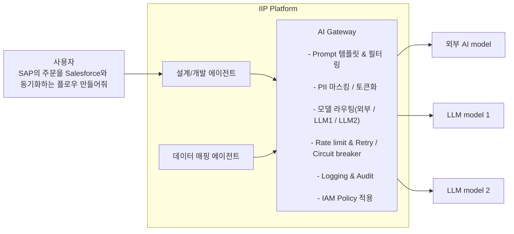

# git_study
내부 테스트 용입니다~

```mermaid
flowchart LR
    U["사용자<br/>SAP의 주문을 Salesforce와 동기화하는 플로우 만들어줘"] --> DA

    subgraph IIP_Platform [IIP Platform]
        DA[설계/개발 에이전트] --> GW
        MA[데이터 매핑 에이전트] --> GW

        GW["AI Gateway<br/>
        - Prompt 템플릿 & 필터링<br/>
        - PII 마스킹 / 토큰화<br/>
        - 모델 라우팅(외부 / LLM1 / LLM2)<br/>
        - Rate limit & Retry / Circuit breaker<br/>
        - Logging & Audit<br/>
        - IAM Policy 적용"]
    end

    GW --> EXT[외부 AI model]
    GW --> L1[LLM model 1]
    GW --> L2[LLM model 2]
```
